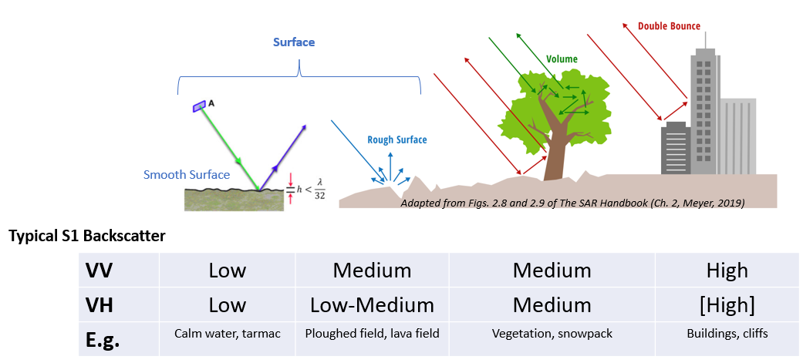
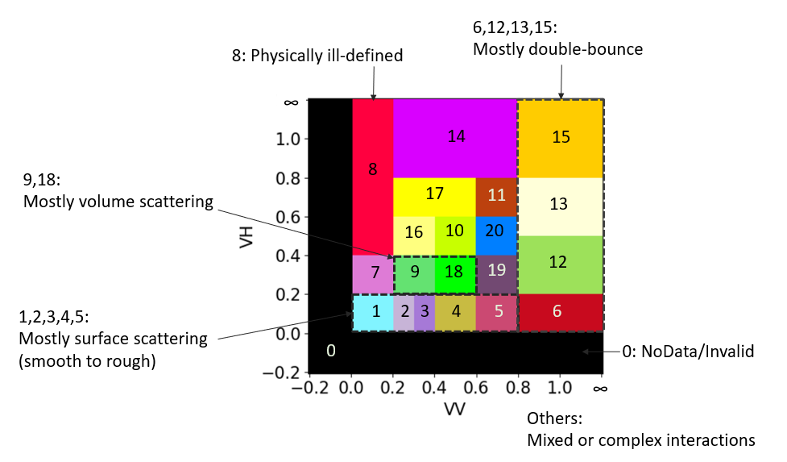
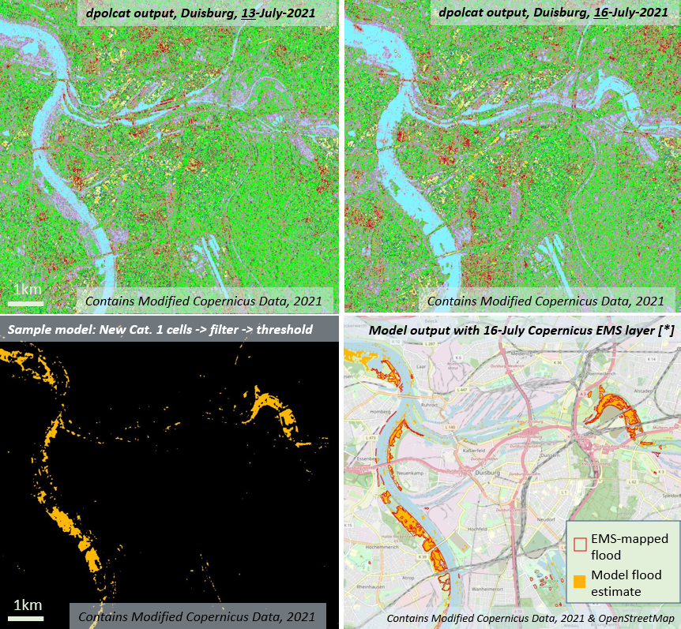
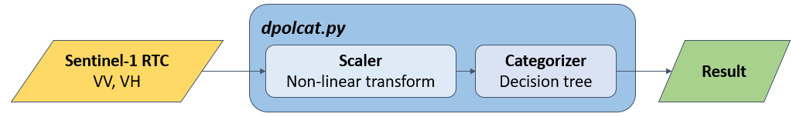

# dpolcat

*dpolcat* is a tool for the semantic categorization of dual-polarimetric synthetic aperture radar (SAR) imagery. (Specifically, Sentinel-1 with VV and VH polarizations at present.)

It is inspired by Dr. Andrea Baraldi's [Satellite Image Automatic Mapper™](http://siam.andreabaraldi.com/) (SIAM™) concept of *spectral categories* for optical data, and the [Sen2Cube](https://www.sen2cube.at/) project.

Status: Effectively at prototype/proof of concept stage, under active development.

## Overview

Different objects on the earth's surface scatter the microwave signals that radar satellites emit and receive, in different ways.

We bin the backscatter received in the same- (VV) and cross-polarized (VH) signals into distinct *polarimetric categories* that give a hint at what's on the ground.

We can then make inferences based on how these categories are distributed in an area, or change over time.

[*]: [Copernicus EMSR517](https://emergency.copernicus.eu/mapping/ems-product-component/EMSR517_AOI06_DEL_MONIT01_r1_RTP03/1)

This is implemented in a Python module that performs a custom scaling, then categorization using a decision-tree algorithm.

.

It uses the [Numba](https://numba.pydata.org/) just-in-time compiler to increase performance, and [Dask](https://www.dask.org) for parallelization.

## Environment

Development and processing are supported within a [Microsoft Planetary Computer](https://planetarycomputer.microsoft.com/) Jupyter Python environment.

These environments are based on [Pangeo](https://github.com/pangeo-data/pangeo-docker-images). This may be an option for use on other platforms, though connection to the EO imagery archive would need to be changed accordingly.

## Contents
#### 📄 `dpolcat.py`

The *dpolcat* module, containing the main algorithms/functions for performing polarimetric categorization.

#### 📄 `dpolcat_demo.ipynb`

A Jupyter Notebook demonstrating the use of *dpolcat*, including a simple end-to-end flood mapping example.

#### 📄 `dpolcat_perf.ipynb`

A Jupyter Notebook for measuring the computational and memory performance of *dpolcat* processing.

#### 📄 `dpolcat_proto.ipynb`

A Jupyter Notebook with the initial design and prototyping of the categorizer algorithms. It features a number of experiments.

#### 📁 `example_duisburg`

Supplementary folder for the demo notebook's flood mapping example, containing a QGIS project and associated data for accuracy assessment.

#### 📄 `media/EARSeL2024-Slides.pdf`

Slides presented at the 43rd EARSeL Symposium in Manchester, UK, 17-June-2024.

#### 📄 `media/poster.pdf`

A simple poster about the project presented internally (based on an older version).

## Credits

Imagery: Contains modified Copernicus Sentinel data, processed by ESA and others.

Flood reference: [Copernicus Emergency Mapping EMSR517](https://emergency.copernicus.eu/mapping/ems-product-component/EMSR517_AOI06_DEL_MONIT01_r1_RTP03/1)

## Authors

Created by Luke McQuade at [Z_GIS](https://www.plus.ac.at/geoinformatik/?lang=en), as part of the the Applied Geoinformatics MSc programme.

## Acknowledgements

We would like to greatly thank the members of the [EO Analytics Group](https://www.plus.ac.at/geoinformatik/research/research-areas/eo-analytics/?lang=en) and Dr. Zhara Dabiri of the [Risk, Hazard and Climate Lab](https://www.plus.ac.at/geoinformatik/research/research-areas/risk-hazard-climate/?lang=en) for their ideas and support, and Assoc. Prof. Hermann Klug and Dr. Bernhard Zagel for their instruction and continuous feedback.

Further developments have been part of my masters thesis, supervised by Prof. Dr. Dirk Tiede, Dr. Martin Sudmanns, and Dr. Zhara Dabiri.  

## References

Augustin, H., Sudmanns, M., Tiede, D., Lang, S., & Baraldi, A. (2019). Semantic Earth observation data cubes. Data, 4(3), 102.
DOI: 10.3390/data4030102

Baraldi, A., Humber, M.L., Tiede, D., Lang, S. (2018). GEO-CEOS stage 4 validation of the Satellite Image Automatic Mapper lightweight computer program for ESA Earth observation level 2 product generation – Part 2: Validation. Cogent Geosci. 4, 1–52.
DOI: 10.1080/23312041.2018.1467254

Meyer, F. (2019), Ch. 2, The SAR Handbook: Comprehensive Methodologies for Forest Monitoring and Biomass Estimation.
DOI: 10.25966/nr2c-s697